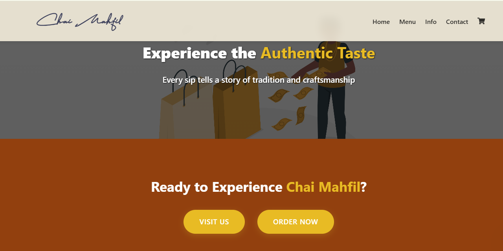

# Chai Mahfil - Tea House Menu & Ordering System
A modern, responsive web application for browsing menu items, managing cart, and placing orders at your local tea house.

---


---

🔗 **Live Site:** [chai-mahfil.vercel.app](https://chai-mahfil.vercel.app/)

---

## Features

- **Interactive Menu Browsing** with category and price filters  
- **Advanced Cart Management** with real-time updates and persistence  
- **Mobile-Responsive UI** for seamless experience across all devices  
- **Smooth Animations** powered by Framer Motion  
- **LocalStorage Integration** to persist user sessions and cart  
- **Order Booking via Phone Call Integration**  
- **User Geolocation Detection** to suggest nearest branches  
- **Real-time Notifications** for order updates and confirmations  
- **Clean, Modular Codebase** using reusable components and Context API  

---

## Technologies Used

- [React.js](https://reactjs.org/) – Frontend framework  
- [CSS Modules](https://github.com/css-modules/css-modules) – Scoped styling  
- [Framer Motion](https://www.framer.com/motion/) – Animation library  
- [React Icons](https://react-icons.github.io/react-icons/) – Icon set  
- [Context API](https://reactjs.org/docs/context.html) – State management  
- [localStorage](https://developer.mozilla.org/en-US/docs/Web/API/Window/localStorage) – Client-side data persistence  

---

## Installation

Follow the steps below to run the project locally:

```bash
# Clone the repository
git clone https://github.com/AbdulAHAD968/LOCAL-CAFE.git

# Navigate to the project directory
cd chai-mahfil

# Install dependencies
npm install

# Start the development server
npm start
```

---

## Project Structure
```bash
chai-mahfil/
├── public/                  # Static files
├── src/
│   ├── components/          # Reusable components
│   │   ├── Cart/            # Cart components
│   │   ├── FilterButtons/   # Filter components
│   │   ├── Header/          # Header component
│   │   └── MenuCard/        # Menu item card
│   ├── pages/               # Main pages
│   │   ├── Cart/            # Cart page
│   │   ├── Menu/            # Menu page
│   │   └── ...              # Other pages
│   ├── plugNplay/           # Sample data
│   ├── App.js               # Main app component
│   └── index.js             # Entry point
├── package.json
└── README.md
```

---

## Contributing
1. Contributions are welcome! Follow these steps:
2. Fork the project
3. Create your feature branch:
```bash
git checkout -b feature/AmazingFeature
```
4. Commit your changes:
```bash
git commit -m 'Add some amazing feature'
```
5. Push to the branch:
```bash
git push origin feature/AmazingFeature
```
6. Open a Pull Request

---

## Future Enhancements
- [x] User authentication and profile management
- [x] Admin dashboard for order and inventory tracking
- [x] Online payment gateway integration
- [x] Firebase/Socket.IO for live order updates
- [x] PWA support for installable experience

---

## License
This project is licensed under the MIT License. See the LICENSE file for details.

---

## Acknowledgments

- [x] React – Frontend framework
- [x] Framer Motion – Animations
- [x] Font Awesome / React Icons – Icons
- [x] StorySet – Free vector illustrations

---

## Gallery

- [x] Landing Page Image
  
- [x] Landing Page CTA
  
- [x] Mahfil Menu Image
  
- [x] Menu Card Image
  
- [x] Cafe Standards Image
  
- [x] Order Cart Image
  
- [x] Customer Reviews Image
  
